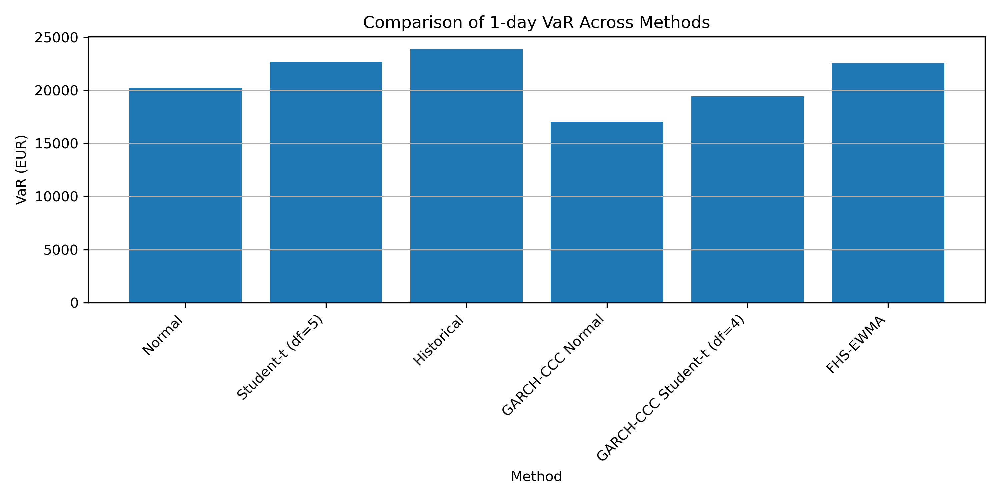

## Example output



# Portfolio Risk Analysis in Python

This project implements a structured portfolio risk analysis workflow in Python.  
It covers both static and conditional risk models for measuring portfolio Value-at-Risk (VaR) and Expected Shortfall (ES), together with backtesting, multi-day risk analysis, and stress testing.

## Project objective

The goal of this project is to analyze the downside risk of a diversified portfolio using multiple market risk methodologies and compare their outputs in a clean, reproducible workflow.

## Portfolio components

The portfolio consists of six components:

- Microsoft (MSFT)
- Shell (SHEL)
- JPMorgan Chase (JPM)
- S&P 500 index (^GSPC)
- EUR/USD exchange rate (EURUSD=X)
- Loan component (LOAN)

## Portfolio weights

The portfolio uses the following fixed weights:

- MSFT: 20%
- SHEL: 15%
- JPM: 15%
- S&P 500: 20%
- EUR/USD: 10%
- LOAN: 20%

## Methods implemented

### Static methods
- Normal variance-covariance VaR and ES
- Student-t variance-covariance VaR and ES
- Historical simulation

### Conditional methods
- GARCH(1,1) with Constant Conditional Correlation (CCC)
- Filtered Historical Simulation with EWMA

### Additional analysis
- Student-t QQ-plot comparison for degree-of-freedom selection
- VaR backtesting
- Multi-day VaR (1-day, 5-day, 10-day)
- Stress testing under equity, FX, and rate shocks
- Final comparison across all methods

## Workflow

1. Build portfolio return and loss series
2. Estimate VaR and ES using static models
3. Select Student-t specification using QQ-plots
4. Backtest VaR models
5. Compare historical multi-day VaR with square-root-of-time scaling
6. Perform stress testing
7. Estimate GARCH-CCC VaR and ES
8. Estimate FHS-EWMA VaR and ES
9. Compare all methods in final tables and figures

## Folder overview

- `code/` → Python scripts
- `data/` → raw and final datasets
- `figures/` → generated plots
- `results/` → generated result tables

## Main outputs

### Figures
- Student-t QQ-plots
- Backtesting plots
- Yearly VaR violations
- Multi-day VaR comparison
- Stress testing VaR changes
- Final VaR and ES comparison plots

### Results
- VaR and ES estimates across methods
- Backtesting tables
- Multi-day VaR tables
- Stress-testing outputs
- GARCH-CCC parameter and matrix outputs
- Final method comparison table

## Key findings

- Normal VaR produces the lowest risk estimates and tends to be the least conservative.
- Student-t and Historical Simulation generate higher VaR and ES estimates, reflecting heavier tails and realized extreme losses.
- VaR violations cluster strongly during stress periods, especially around 2020.
- Multi-day VaR shows that square-root-of-time scaling is a useful benchmark, but it becomes less accurate at longer horizons.
- Stress testing shows that portfolio downside risk is driven mainly by equity shocks.
- Conditional methods such as GARCH-CCC and FHS-EWMA provide a more dynamic view of risk under changing volatility conditions.


## How to run

Install dependencies first:

```bash
pip install -r requirements.txt